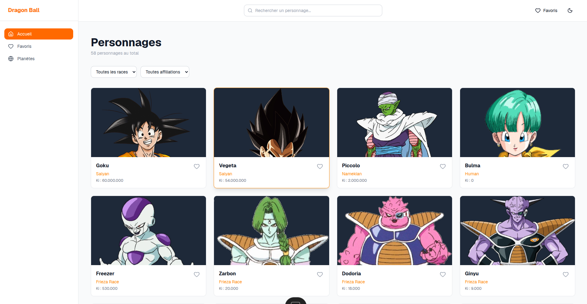
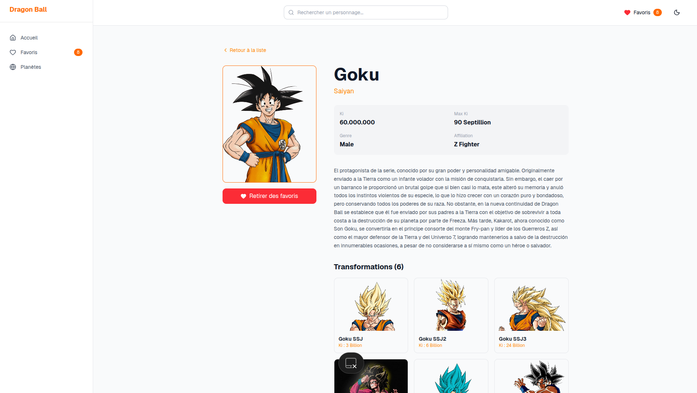
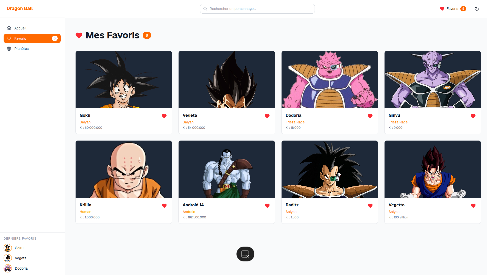
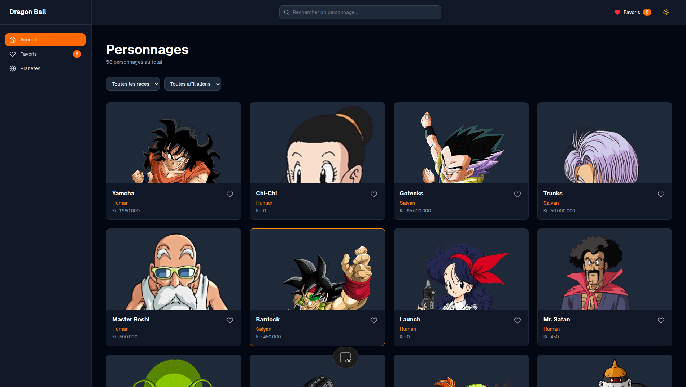
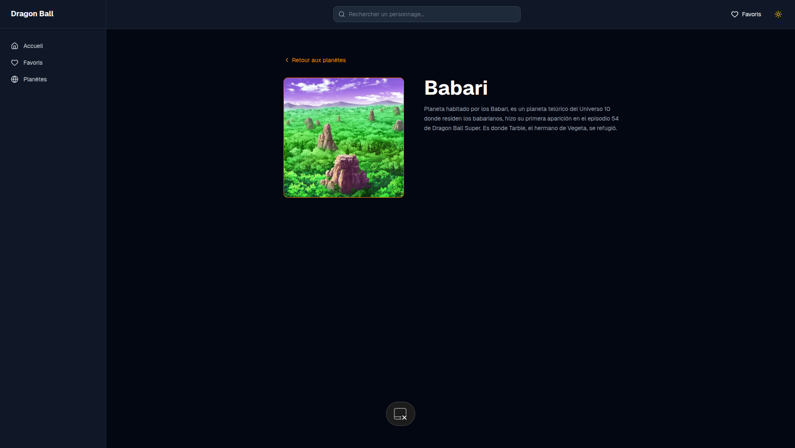

Dragon Ball Wiki

Un wiki interactif des personnages et planètes de Dragon Ball, construit avec React.

##  Fonctionnalités

- Liste paginée de tous les personnages
-  Recherche en temps réel depuis n'importe quelle page
-  Filtres par race et affiliation
-  Système de favoris
-  Page des planètes avec détails
-  Mode sombre / clair
-  Sidebar de navigation

##  Stack technique

| Outil | Rôle |
|---|---|
| React 18 | Framework UI |
| Vite | Bundler |
| Tailwind CSS v4 | Styles |
| Axios | Appels API |
| React Query | Gestion des données |
| React Router | Navigation |
| Lucide React | Icônes |


### Screenshots
<div align="center">

### Page d'accueil


### Page détail personnage


### Page favoris


### Page planètes


### Page dark


### Page Détail planet



</div>


##  Installation

```bash
# Cloner le projet
git clone https://github.com/TonUsername/dragon-ball.git
cd dragon-ball

# Installer les dépendances
npm install

# Lancer le serveur
npm run dev
```

## 🌐 API utilisée

[Dragon Ball API](https://dragonball-api.com) — API gratuite fournissant personnages, transformations et planètes.

##  Structure du projet
src/
├── api/          # Appels Axios
├── context/      # Contextes globaux (thème, favoris, recherche, filtres)
├── components/   # Composants réutilisables
└── pages/        # Pages de l'application

##  Auteur

Mariama Baldé — L3 Informatique, UGANC